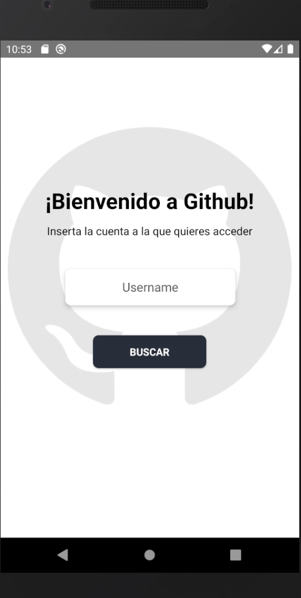

# NVMBER Technical test

Github clone according to the requirements and more things added.

## Installation

After clone this repo =>

1. npm i
2. use npx react-native run-android/ios.

## Preview

This is the landing page, as required, it has an input for insert a username.

But if you take a look, when you start typing there's an animation with an arrow:

This button allow you to delete.

Furthermore, I have added a loader when you send the username:

:star2::star: Now let's have a look at the next screen :star::star2:

### This is our Profile page

And I would like to explain you a few things, there are some thing happening that you won't realize if you don't search 3 profiles or more, and is that this profile page is dynamic according to the user info provided by the API.

##### :spades: First:

A Github Profile can have url links as twitter or a personal website, this information is being displayed if the API have it, normally it does but if you have a look on other profiles, you will check that they have an email and the API does not provide that information.

##### :clubs: Second:

If you click on one of these options, it prints in the screen the followers, people you are following and your starred projects, and of course, Mine too 🌟!

##### :clubs: Third:

This app has an horizontal scrollview:

Allows the user to watch four sections =>

1. Overview
2. Repositories
3. Packages
4. Projects

The same content we have in **GitHub's page**.

If you watch the Overview section, there's a rectangle that can display 2 sentences, the first:

*"Click to see my secret readme!"*

And the second is that if you don't have a readme in your profile, a sentence will be displayed, *"I think it's time to make your secret Readme..."* and, I have added a link that will give you a hint :grin:

On the other hand, we have the repositories, which is one of the requirements for this app:

User's repositories are being displayed on our screen and if you click them, you can go to their GitHub repository.

If you didn't sleep, I hope not, we will see our package section:

What we have here is the same you can watch in the GitHub page.

**And finally, what we have here are the projects:**

Unfortunately, in GitHub's API, I found some endpoints but not the one that retrieves user's projects.

So, what whe have here is a static component that display's user's username only.

### Extra Credits :yum:

During these four days of intense work, I've finally decided going for the commits button and documented code.

If you inspect my code, you will see some code which is explained, I think that my code is understandable but in some places as axios callings I've put some code and why I did that way.

On the other hand, we have the commits button.

#### Tools and libraries:

For creating this technical test I've used =>

1. *Native base:*

Url: https://nativebase.io/

2. *React Native Chart Kit:*

Url: https://www.npmjs.com/package/react-native-chart-kit

3. *LottieFiles && Lottie React Native:*

Url: https://github.com/lottie-react-native/lottie-react-native

4. *React Native Animatable:*

Url: https://github.com/oblador/react-native-animatable

5. *React Native Shadow Generator:*

Url: https://ethercreative.github.io/react-native-shadow-generator/

6. *React Hooks:*

useState: Allow you to storage information and being used at the moment you need.

useEffect: Allow you to render information and its syntax let you decided when.

### Error message

In our landing page, what we find are two messages, **first** is when our Input component is empty:
"Introduce un usuario"

And **second** is:
"Usuario no encontrado"

For that, I used the status which is being retrieved when we make a call to our API endpoint.

And now the final moment arrived, let me show you how it looks like github page in a mobile phone and how it looks like on my app :star_struck::

GitHub Website:

### Backlog:

1. *Navbar:*

This technical test was about having a profile page with repos, but as I did a clone of github in four days, in my navbar should be topics as "Why github".

2. *Repositories Section:*

In Github page there are two more filters which are being displayed as a dropdown.

3. *Projects Section:*

Being able to see how many projects the user has.

4. *GraphQL:*

API calls were made with Axios but, I tried to learn how GraphQl works last wednesday and I did a backend to practice, here is the link if you want to check it: https://github.com/Zetzher/crud-graphql-native

But I thought that for the time I had, it was better to make a clone instead of a simple repositories page.

5. *Testing:*

Unfortunately, testing is one topic that I did a few times, my tool was Jest but I did not mastered, is one tool that I want to use.
