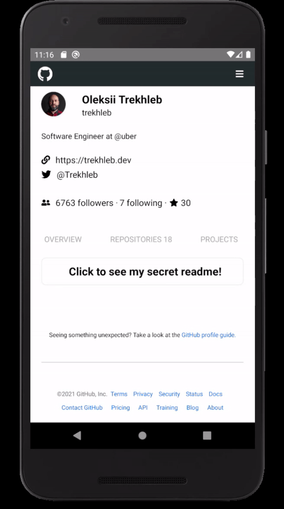

# NVMBER Technical test

Github clone according to the requirements and more things added.

## Installation

After clone this repo =>

1. npm i
2. use _npx react-native run-android/ios_

## Preview
GitHub Website:

My version: 

### This is our Profile page

There are some things happening that you won't realize until you search 3 profiles or more, and is that this profile page is dynamic according to the user info provided by the API.

### Navbar

The icon allow you to go to the landing page and search for another Github's user.

#### :spades: First:

A Github Profile can have url links as twitter or a personal website, this information is being displayed if the API have it, normally it does but if you pay attention at other profiles, you will check that they have an email and the API does not provide that information.

#### :clubs: Second:

If you click on one of these options, prints the followers, the people you are following and starred projects.

#### :clubs: Third:

This app has an horizontal scrollview:

Allows the user to watch four sections =>

1. Overview
2. Repositories
3. Packages
4. Projects

The same content we have in **GitHub's page**.

If you watch the Overview section, there's a rectangle that can display two sentences.

The first:

_"Click to see my secret readme!"_

And the second is, if you don't have a readme in your profile, a sentence will be displayed => _"I think it's time to make your secret Readme..."_ and, I have added a link that will give you a hint :grin:

On the other hand, we have the repositories, which is one of the requirements for this app:

User's repositories are being displayed on our screen and if you click them, you can go to their GitHub repository.

If you didn't sleep, I hope not, you will see our package section:

What we have here is the same you can watch in GitHub page.

**And finally, what we have here are the projects:**

Unfortunately, in GitHub's API, I found some endpoints but not the one that retrieves user's projects.

So, what we have here is a static component that display's user's username only.

### Extra Credits :yum:

During these four days of intense work, I've finally decided to go with the commits button and documented code.

If you inspect my code, you will see is explained, I think that my code is understandable but in some places, as axios callings, I've put some comments and why I did that way.

On the other hand, we have the commits button.

## Tools and libraries:

For creating this technical test I've used =>

1. _Native base:_

    Url: https://nativebase.io/

2. _React Native Chart Kit:_

    Url: https://www.npmjs.com/package/react-native-chart-kit

3. _LottieFiles & Lottie React Native:_

    Url: https://github.com/lottie-react-native/lottie-react-native

4. _React Native Animatable:_

    Url: https://github.com/oblador/react-native-animatable

5. _React Native Shadow Generator:_

    Url: https://ethercreative.github.io/react-native-shadow-generator/

6. _React Hooks:_

    useState: Allow you to storage information that will be used at the moment you need.

    useEffect: Allow you to render information and its syntax let you decided when.

### Error message

In our landing page, what we find are two messages, **first** is when our Input component is empty:
"Introduce un usuario"

And **second** is:
"Usuario no encontrado"

For that, I used the status which is being retrieved when we make a call to our API endpoint.

### Backlog:

1. _Navbar:_

It has only "Profile" and "Commits" but, it should have topics as "Why github".

2. _Repositories Section:_

In Github page there are two dropdowns.

3. _Projects Section:_

Being able to see how many projects the user has.

4. _GraphQL:_

API calls were made with Axios but, I tried to learn how GraphQl works last wednesday and I did a backend to practice, here is the link if you want to check it: https://github.com/Zetzher/crud-graphql-native

But I thought that for the time I had, it was better to make a clone instead of a simple repositories page.

5. _Testing:_

Unfortunately, testing is one topic that I did a few times but I didn't have time to implement it in my code.
